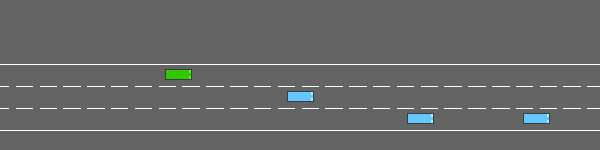
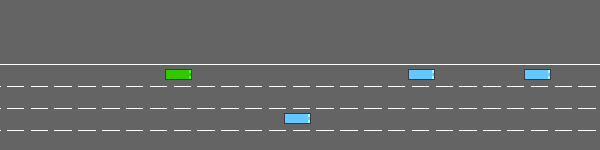
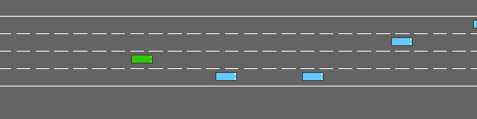
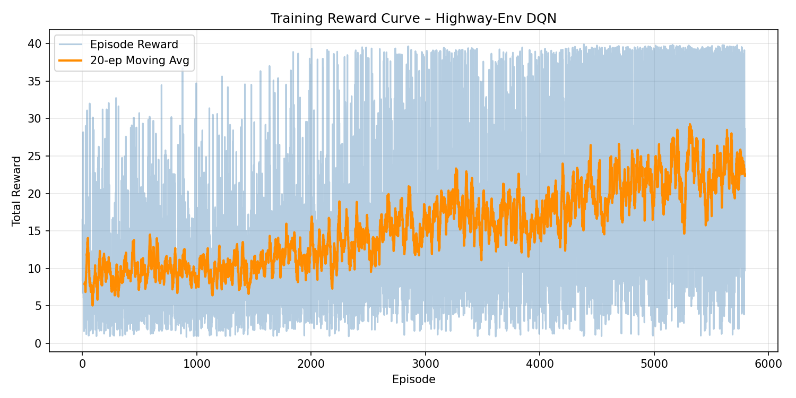

# CMP4501 – Highway-Env DQN Agent

> **Course:** Introduction to AI & Expert Systems  
> **Environment:** [highway-v0](https://highway-env.farama.org/) · **Algorithm:** DQN (Deep Q-Network)

---

## Evolution Video

| Untrained | Half-Trained | Fully Trained |
|:---------:|:------------:|:-------------:|
|  |  |  |

---

## 1. Environment

**Highway-v0** is a highway driving simulation where the agent controls a vehicle surrounded by traffic. The goal is to drive as fast as possible while avoiding collisions.

- **State space:** 5 x 5 matrix — positions and velocities of the 5 nearest vehicles `[x, y, vx, vy, cos_h]`, normalized
- **Action space:** 5 discrete meta-actions — `LANE_LEFT`, `IDLE`, `LANE_RIGHT`, `FASTER`, `SLOWER`

---

## 2. Custom Reward Function

The reward function balances speed and safety:

```math
r(s, a) = w_1 \cdot r_{\text{speed}} + w_2 \cdot r_{\text{collision}} + w_3 \cdot r_{\text{right\_lane}}
```

Where:

```math
r_{\text{speed}} = \frac{v - v_{\min}}{v_{\max} - v_{\min}}, \quad v \in [20, 30] \text{ m/s}
```

```math
r_{\text{collision}} = \begin{cases} -2.0 & \text{if collision} \\ 0 & \text{otherwise} \end{cases}
```

```math
r_{\text{right\_lane}} = 0.1 \times \text{(right lane bonus)}
```

| Weight | Value | Purpose |
|--------|-------|---------|
| w1 (high speed) | 1.0 | Encourage fast driving |
| w2 (collision) | -2.0 | Heavily penalize crashes |
| w3 (right lane) | 0.1 | Prefer right lane |

---

## 3. Algorithm & Hyperparameters

**Deep Q-Network (DQN)** was chosen because the action space is discrete and the state space is low-dimensional, making DQN a natural fit.

| Hyperparameter | Value | Reason |
|----------------|-------|--------|
| Learning rate | 5e-4 | Stable convergence |
| Batch size | 32 | Memory efficient |
| Buffer size | 15,000 | Sufficient experience replay |
| Gamma (y) | 0.8 | Moderate future discounting |
| Exploration fraction | 0.7 | Long exploration phase |
| Final epsilon | 0.1 | Some randomness retained |
| Target update interval | 50 | Stable target network |
| Total timesteps | 100,000 | Enough for convergence |

---

## 4. Training Results



| Metric | Untrained | Half-Trained | Fully Trained |
|--------|-----------|--------------|---------------|
| Mean Reward | ~0 | ~15 | ~23 |
| Mean Episode Length | ~5 | ~15 | ~25 |
| Exploration Rate | 1.0 | 0.3 | 0.1 |

The agent showed clear improvement across training stages. Mean reward nearly doubled from the halfway point to completion, and episode length increased significantly — indicating the agent learned to avoid collisions and sustain longer drives.

---

## 5. Challenges & Solutions

| Challenge | Solution |
|-----------|----------|
| Observation shape mismatch (5x6 vs 5x5) | Reduced features from 6 to 5 in config |
| Slow training on CPU | Reduced buffer size and used DQN instead of PPO |
| GIF recording without display | Used rgb_array render mode with imageio |

---

## 6. Project Structure

```
cmp4501-project/
├── src/
│   ├── config.py        # Environment & training configuration
│   ├── model.py         # DQN model definition
│   ├── train.py         # Training script with checkpoints
│   ├── evaluate.py      # Evaluation script
│   ├── record_video.py  # GIF recording script
│   └── utils.py         # Reward logger & plotting
├── models/
│   ├── untrained.zip
│   ├── half_trained.zip
│   └── final.zip
├── assets/
│   └── reward_plot.png
├── videos/
│   ├── untrained.gif
│   ├── half_trained.gif
│   └── final.gif
└── requirements.txt
```

## 7. Setup & Run

```bash
# Create virtual environment
py -3.11 -m venv venv
venv\Scripts\activate

# Install dependencies
pip install -r requirements.txt

# Train the agent
python -m src.train

# Record evolution videos
python -m src.record_video

# Evaluate final model
python -m src.evaluate
```